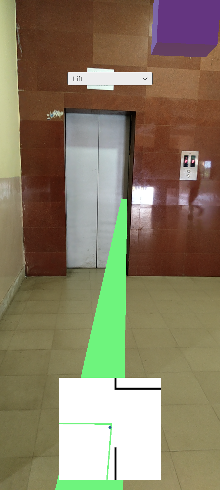

## Project Name
*NAKSHA*

## Domain
- App Development
- Augumented Reality

## Link to repository
[NAKSHA](https://github.com/debanwita27/Naksha)

## About Project
Navigating a new space is always intimidating. We cannot 'Google-Maps' our way through corridors and unlisted spaces. It becomes all the more difficult if you cannot understand the local language. Moreover, GPS fails to work in closed spaces.  
*NAKSHA* is an indoor navigation solution for navigating premises inside an organisation. With AR at its core, it aims to aid people to find their way around new places easier than ever.

**Tech stack**:
- Unity 3D
- C#
- ARKit ( for Android Dev)

## Use Cases of your project
- inside large organisations
- around campuses(institutes/ hospitals/ museums/ libraries)
- inside buildings
- inside offices

## Team Members
- [Suraj Kumar Sharma](https://github.com/suraj5625)
- [Debanwita Mahato](https://github.com/debanwita27)
- [Shweta Jha](https://github.com/SHWETA2JHA)
- [Putul Kumari](https://github.com/Putul1519)

## Screenshots

